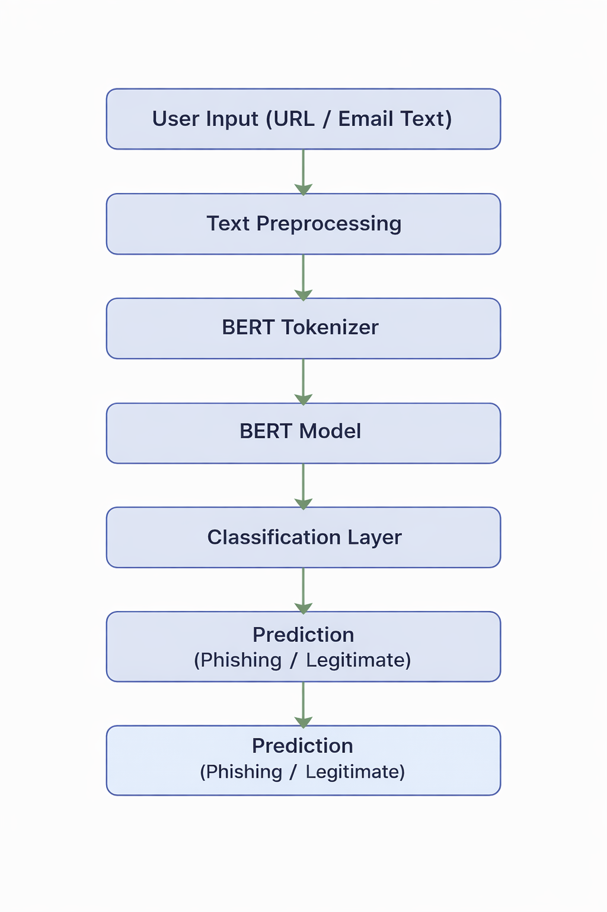
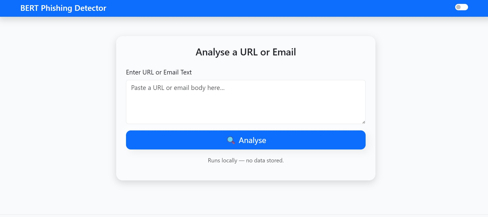
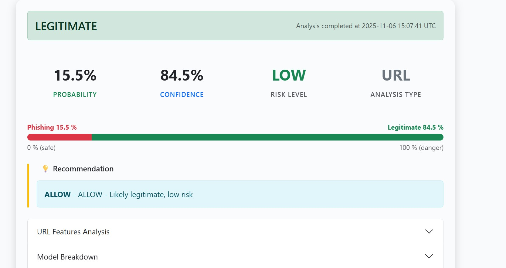

# 🛡️ BERT-Based Phishing Detection System


An **AI-powered phishing detection system** that uses **Natural Language Processing (NLP)** and **BERT (Bidirectional Encoder Representations from Transformers)** to detect phishing URLs, emails, and suspicious text in real time.

This project demonstrates how **deep learning can be applied to cybersecurity** to automatically identify phishing attacks.

---

# 🚀 Features

✔ Detect phishing **URLs and email text**  
✔ Powered by **BERT deep learning model**  
✔ Real-time prediction using a **Flask web interface**  
✔ REST API support for automation  
✔ End-to-end pipeline: **data → training → prediction**

---

# 🧠 Technologies Used

- Python  
- BERT (Transformers)  
- PyTorch  
- Flask  
- Pandas  
- Scikit-learn  

---

# 🏗️ System Architecture

<p align="center">
  
</p>
---

# 📂 Project Structure

```
BERT_Phishing_System
│
├── data/                # Training dataset
├── models/              # Saved BERT model
├── static/              # CSS / JS files
├── templates/           # HTML frontend
│
├── app.py               # Flask web application
├── predict.py           # Prediction script
├── train_model.py       # Model training pipeline
├── requirements.txt     # Project dependencies
└── README.md
```

---

# ⚙️ Installation

## 1️⃣ Clone the Repository

```
git clone https://github.com/suryagandhan/BERT_Phishing_System.git
cd BERT_Phishing_System
```

---

## 2️⃣ Create a Virtual Environment

```
python -m venv .venv
```

Activate it

Mac / Linux

```
source .venv/bin/activate
```

Windows

```
.venv\Scripts\activate
```

---

## 3️⃣ Install Dependencies

```
pip install --upgrade pip
pip install -r requirements.txt
```

---

# 📊 Dataset Preparation

Create a folder

```
data/
```

Inside it place two CSV files

| File | Purpose |
|-----|-----|
| train.csv | Model training |
| valid.csv | Model validation |

Example dataset format

```
text,label
http://secure-paypa1.com/verify,1
https://www.microsoft.com,0
Email body: Dear user verify your account,1
```

Label meaning

```
0 = Legitimate
1 = Phishing
```

---

# 🏋️ Train the Model

Run the training script

```
python train_model.py
```

During training the script will

- Load **bert-base-uncased**
- Tokenize input text
- Train the phishing classifier
- Evaluate performance

After training the model is saved in

```
models/
├── config.json
├── pytorch_model.bin
└── tokenizer/
```

---

# 🌐 Run the Web Application

Start the Flask server

```
python app.py
```

Open in browser

```
http://127.0.0.1:5000
```

Paste a **URL or email text** and the system will predict whether it is phishing.

---

# 🔌 REST API Usage

Example request

```
POST /predict
```

Input JSON

```
{
"text": "Verify your account immediately at http://secure-paypa1.com"
}
```

Output

```
{
"prediction": "phishing",
"confidence": 0.97
}
```

---

# 📈 Model Performance

Example evaluation metrics

| Metric | Score |
|------|------|
| Accuracy | 94% |
| Precision | 93% |
| Recall | 92% |
| F1 Score | 92% |

*(Results may vary depending on dataset used.)*

---

# 🖥️ Demo

### Web Interface

<table align="center">
<tr>
<td align="center">
<br>
<b>Input Interface</b>
</td>

<td align="center">
<br>
<b>Prediction Result</b>
</td>
</tr>
</table>
---

# 🔒 Cybersecurity Applications

This system can be used in

- Email security systems
- Web filtering tools
- Security Operations Centers (SOC)
- Threat intelligence pipelines
- Browser phishing protection

---

# ⚡ Training Optimization Tips

| Need | Option |
|-----|-----|
| Freeze BERT layers | `--freeze-bert` |
| Gradient accumulation | `--accum 4` |
| Handle class imbalance | `--balance` |
| Probability calibration | `--calibrate` |

---

# 📌 Future Improvements

- Real-time browser phishing detection  
- Chrome extension integration  
- Large-scale phishing dataset training  
- Docker deployment  
- API authentication  

---

# 👨‍💻 Author

**Suryagandhan**

Cybersecurity Student | SOC Analyst Aspirant  

[](https://linkedin.com/in/suryagandhan)

---

# ⭐ Support

If you found this project useful, consider **starring the repository**.
